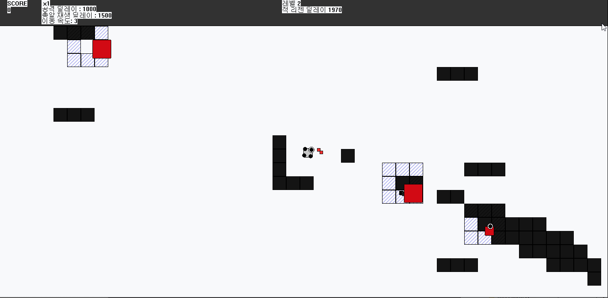
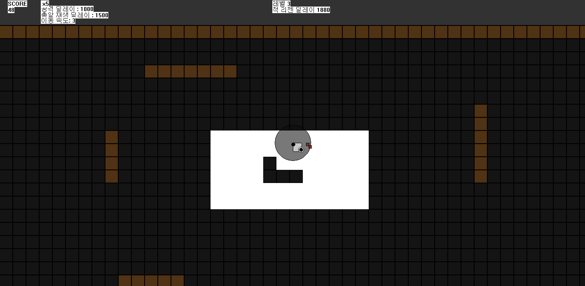
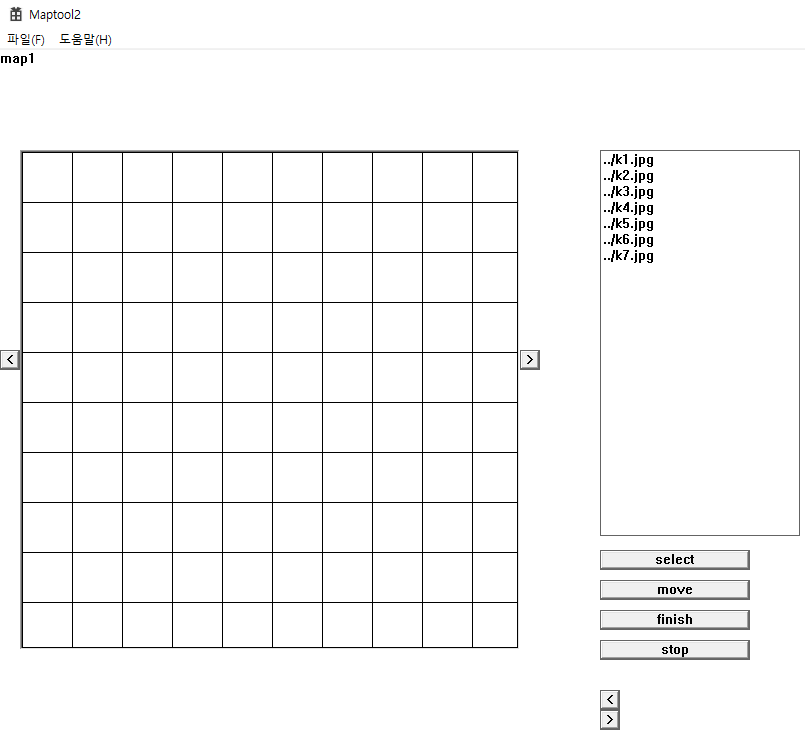
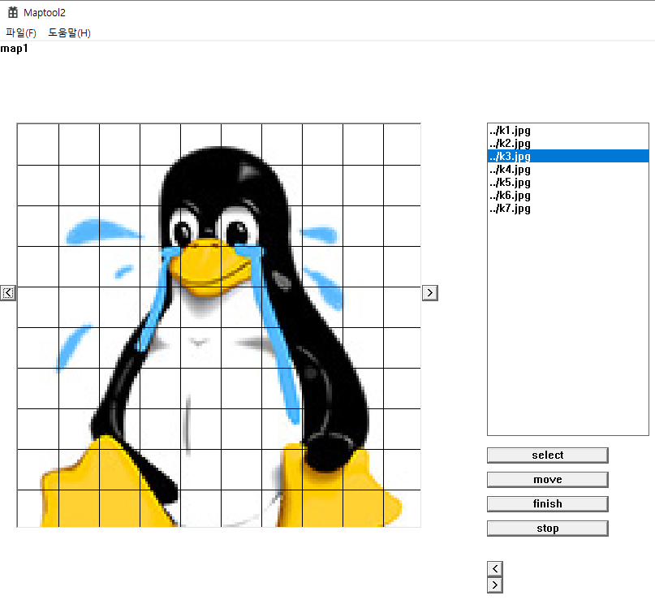
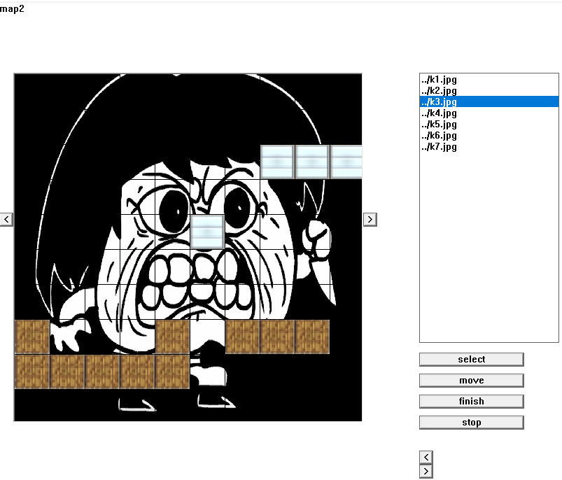
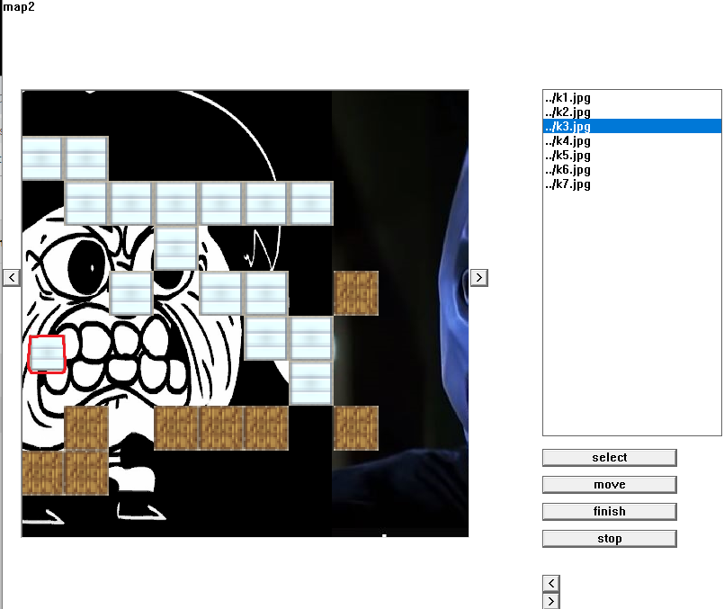
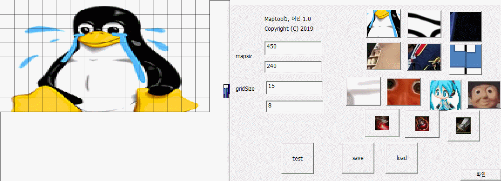

## 과제 Inversus 모작

[https://www.inversusgame.com/](https://www.google.com/url?q=https://www.inversusgame.com/&sa=D&ust=1561353886759000)

아래 사진은 난이도 3 플레이 : 갈색 블럭은 총알이 막혀 궁극기 사용시 치명적이다.

### 게임의 기본

보드는 검은색과 흰색 타일로 구성되어 있다.

플레이어는 흰색의 타일에서만 이동이 가능하고, 총을 쏴서 검은색 공간의 색을 흰색

으로 전환

wasd 키로 이동

스페이스바로 바라본 방향 공격

1, 2, 3 번 키로 난이도 변경가능

난이도 하: 기본 칸만 있는 보드

난이도 중: 기본 칸의 보드와 장애물 (한 종류)

– 장애물: 총알로 폭발 가능, 캐릭터 통과 X, 적 통과 가능

난이도 상: 중간에 장애물 놓는다. (두 종류의 장애물)

– 장애물 1: 총알로 폭발 가능, 캐릭터 통과X, 적 통과 가능

– 장애물 2: 총알로 폭발 불가능, 캐릭터 통과X, 적 통과 가능

적을 연속처치시 콤보 생성

적 잡을때마다 점수 생성

총알에 그라데이션

적과 충돌시 화면이 흔들리는 효과

### 게임 진행

#### 플레이어 캐릭터

흰색 타일에서만 이동 가능

적이 만나면 플레이어가 사라진다.

사망할 때는 폭발이 일어난다. 폭발에 적 접촉시 적 사망

죽으면 일정시간이 지난 뒤에 부활한다.

사각형 모양이고 가운데에는 총알(6발)이 회전하고 있다.

#### 총알의 종류

일반 총알

특수 총알 : 적을 죽이면 얻을 수 있다. 2발 이상이 동시에 발사된다.

궁극기 총알 : 0.1초당 3개로 분리되는 총알을 발사한다.

#### 적 캐릭터

적은 어디든지 다닐 수 있고, 적이 지나간 곳은 검은색 타일로 전환된다.

적이 사망할 때는 폭발이 일어난다. 폭발에 닿은 다른 적은 같이 죽는다.

일정시간마다 적이 생성되고 점점 생성되는 시간이 짧아진다.

적 위치를 기준으로 주변 8타일에 빗금으로 영역 표시한다.

일반 적

총을 가진 적

체력이 많은 적

#### 지속아이템

이동속도증가

공격속도증가

총알재생속도증가

## Maptool2 횡스크롤 러닝 게임을 위한 맵툴

실습 7-3을 이용하여 횡스크롤 런닝 게임을 만들어 본다.

### 배경 넣기

• 실습 7-3을 이용하여 좌우로 맵을 늘려갈 수 있도록 한다.

• 최소 3개의 맵을 연결해보도록 한다.

### 발판 만들기

• 2종류의 발판을 선택하여 보드의 칸에 넣을 수 있도록 한다.

• 마우스를 클릭 & 드래그 하여 발판을 놓는다.

### 테스트 버튼

• 테스트하기를 누르면 캐릭터가 나타나서 발판을 이용하여 횡으로 달릴

수 있도록 한다.

• 배경이 자동으로 좌측으로 이동하며 연결된 맵이 보인다.

### 키보드 입력

좌우화살표키로 이동

위화살표키로 점프

Select로 사진추가

블럭 선택 버튼을 눌러 블럭선택

드래그로 맵에 설치

Move키를 누르면 화살표키로 조작가능한 플레이어가 떨어지며 카메라가 천천히 오른쪽으로 이동한다.

## Maptool1 적, 아이템 배치 및 테스트

1번째 줄 버튼 3개 : 배경 이미지 변경

2번째 줄 버튼 3개 : 블럭타일 종류

3번째 줄 버튼 4개 : 적 종류

1번째 적 이동 : 상->하->좌->우->상 순서대로 움직임

2번째 적 이동 : 주인공만 쫓는다

3번째 적 이동 : 현위치에서 좌우로만 이동

4번째 적 이동 : 플레이어를 따라오며 꼬리가 달려있다.

4번째 줄 버튼 3개 : 블럭타일 내에 위치할 아이템 종류

에디터안에서는 블럭보다 위에 위치하고

테스트에선 타일을 부셔야 나오는 아이템이기에 아래로 내려감

# 그 외에 과제들은 여기까지 오기위한 기반이었기에 설명은 생략하겠습니다.