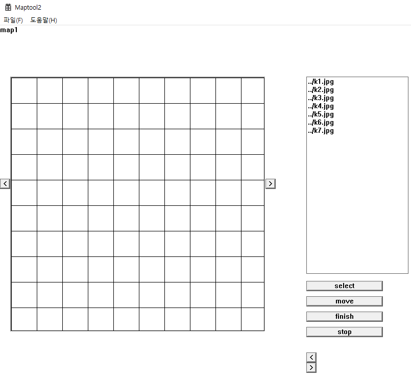
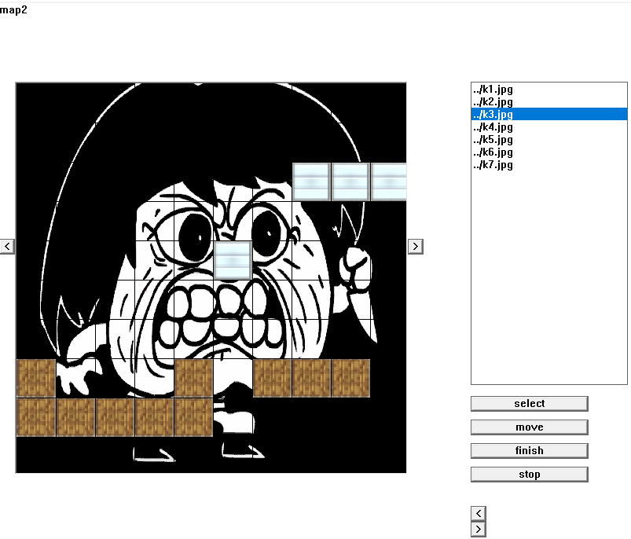

## Maptool2 횡스크롤 러닝 게임을 위한 맵툴

• 실습 7-3을 이용하여 횡스크롤 런닝 게임을 만들어 본다.

### – 배경 넣기:

• 실습 7-3을 이용하여 좌우로 맵을 늘려갈 수 있도록 한다.

• 최소 3개의 맵을 연결해보도록 한다.

### – 발판 만들기

• 2종류의 발판을 선택하여 보드의 칸에 넣을 수 있도록 한다.

• 마우스를 클릭 & 드래그 하여 발판을 놓는다.

### 테스트 버튼

• 테스트하기를 누르면 캐릭터가 나타나서 발판을 이용하여 횡으로 달릴

수 있도록 한다.

• 배경이 자동으로 좌측으로 이동하며 연결된 맵이 보인다.

### 키보드 입력

– 좌우로 이동하기

– 점프하기: 발판을 이용하여 점프하기

Select로 사진추가

블럭 선택 버튼을 눌러 블럭선택

드래그로 맵에 설치

Move키를 누르면 화살표키로 조작가능한 플레이어가 떨어지며 카메라가 천천히 오른쪽으로 이동한다.

